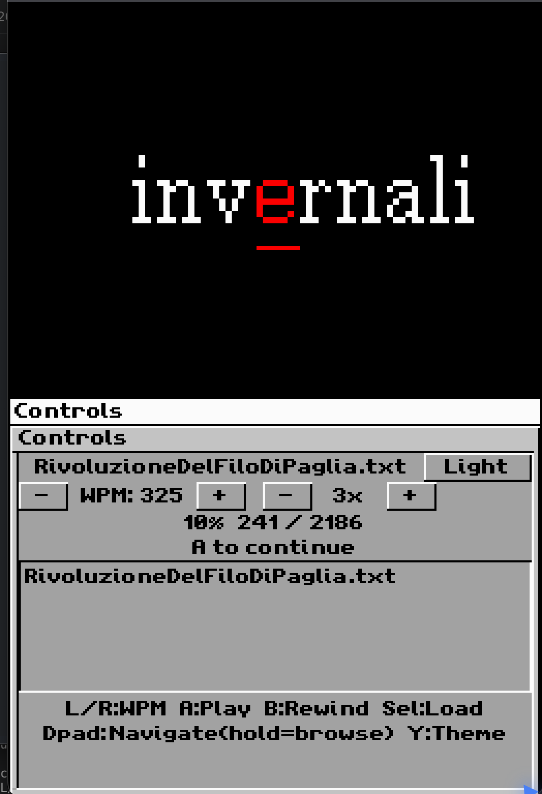

# RSVPReaderDS

A **Rapid Serial Visual Presentation (RSVP)** e-reader for the Nintendo DS, built with the [Woopsi](https://woopsi.org) UI framework.

Inspired by [RSVPNano](https://github.com/ionutdecebal/rsvpnano), this homebrew lets you read plain-text and EPUB books on your DS at speeds from 50 to 1000 WPM, with the focus letter always anchored at the centre of the top screen.



---

## Features

- **ORP highlighting** — the Optimal Recognition Point letter (~35% into each word) is displayed in red and underlined, guiding your eye to the natural fixation point
- **Adaptive pacing** — longer words and words followed by punctuation automatically get extra display time
- **Browse / page mode** — press D-pad Left/Right to step word by word through a fixed page of text, with the red cursor moving across it; Up/Down flips a full page at a time; release to return to single-word reading after 0.5 s
- **EPUB support** — `.epub` files are loaded directly alongside `.txt` files
- **Scalable font** — choose 1×–4× text size with the on-screen buttons; auto-shrinks for long words so they always fit
- **Dark / light theme** — toggle with the **Y** button or the on-screen button
- **Autosave** — position, WPM, and book are saved automatically every 10 seconds; press **Start** to save immediately
- **Punctuation consolidation** — closing brackets, dots, and other punctuation-only tokens are merged with the adjacent word so they never appear alone

---

## Download

Grab the latest **RSVPReaderDS.nds** from the [Releases](../../releases/latest) page and copy it to your flashcart.

---

## SD Card Setup

The reader looks for books in a `/books/` folder at the root of your SD card.

```
SD card root
└── books/
    ├── moby-dick.txt
    ├── frankenstein.epub
    └── ...
```

- Supported formats: **`.txt`** (plain text, UTF-8 or ASCII) and **`.epub`**.
- Non-ASCII characters are silently skipped, so books with mostly Latin text work best.
- Up to **100 000 words** are loaded per book.
- Reading progress is saved to `/books/.state` **automatically every 10 seconds** and also when you press **Start**.

> **melonDS users**: enable DLDI in *Config → Emu Settings → DLDI* and point it at a folder that contains a `books/` subdirectory.

---

## Controls

| Button | Action |
|---|---|
| **A** | Play / Pause (or load highlighted book if none loaded) |
| **B** | Rewind to start of current sentence |
| **L** | Decrease WPM (−25) |
| **R** | Increase WPM (+25) |
| **D-pad ↑ / ↓** | Page up / down in browse mode |
| **D-pad ← / →** | Step ±1 word; hold for continuous scroll through the page |
| **Y** | Toggle dark / light theme |
| **Start** | Save reading position immediately |
| **Select** | Load highlighted book from list |
| **Start + Select** | Quit |

Touch the **−** / **+** buttons on the bottom screen to adjust WPM and font size.

---

## Building from Source

### Requirements

- [devkitPro](https://devkitpro.org) with devkitARM and libnds
- [calico](https://github.com/devkitPro/calico) (ARM7 runtime)
- [Woopsi](https://github.com/ant512/Woopsi) built as `libwoopsi` at `~/devkitpro-libs/woopsi/Woopsi/libwoopsi` (or set `WOOPSI=` in the Makefile)

### Build

```bash
chmod +x build.sh
./build.sh
```

This produces `RSVPReaderDS.nds` and opens it in melonDS.

---

## Credits

- Original RSVP concept: [RSVPNano](https://github.com/ionutdecebal/rsvpnano) by ionutdecebal
- UI framework: [Woopsi](https://woopsi.org) by Ant512
- Built with [devkitPro](https://devkitpro.org)
